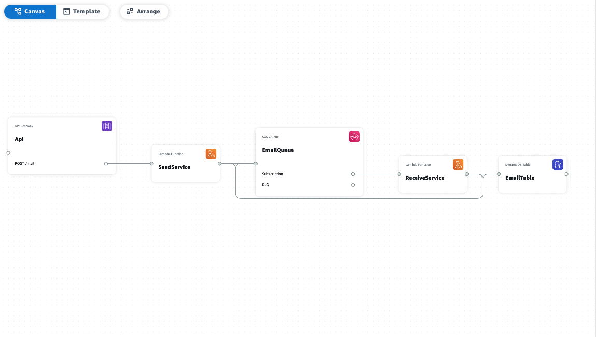

# SAM Email Service

## Architecture



This project is the replication of [Scalable-sending-email-service](https://github.com/messaismael/scalable-send-email-service#readme) but instead use [claudiaJs](https://claudiajs.com/), we used rather [SAM](https://aws.amazon.com/serverless/sam/) as Serverless Framework and [AWS Application Composer](https://aws.amazon.com/application-composer/) to build our architecture.

These are two lambda functions that walks together to process emails while avoiding the risk of failure and duplication in sending using **AWS SES** and **AWS DynamoDB**.

The first function gets data related to the email after an API call, then push them in queue and some informations related to this email in the database (messageId, status).

The second function is triggered when something it pushed in the queue. Afterwards it pulls messages(email data) and send email while checking and updating the its status in the BD.

## Resources

[Improve Email Sending with Amazon SQS](https://medium.com/@messaismael/improve-email-sending-with-amazon-sqs-4bca9b9572b1)

## Tools

- AWS SAM
- AWS Application Composer
- AWS SES
- AWS SQS
- AWS lambda
- AWS DynamoDB
- TypeScript

## Install

```
$ git clone https://github.com/messaismael/sam-email-service
$ cd sams-email-service
```

### SendService

```
$ cd functions/send_service
$ npm install
```

### ReceiveService

```
$ cd functions/receive_service
$ npm install
```

## Configs

Using SAM, all configs are centralized in the `template.yml` file. In our case, You should just provide the email(s) of the receiver(s) for the **ReceiveService** into `TO_EMAILS` variable in this [file](template.yaml).

```
...
        Variables:
          TABLE_NAME: !Ref EmailTable
          QUEUE_NAME: !GetAtt EmailQueue.QueueName
          QUEUE_URL: !Ref EmailQueue
          TO_EMAILS: your_address_email
...
```

## Deploy

To build and deploy your application for the first time, run the following in root directory where the `template.yml` file is located:

```
$ sam build
$ sam deploy --guided
```

## Run

After deployement done, SAM CLI will print out the stack's output, including the new application URL.You can use PostMan. The URL looks like:

```
https://xxxxxxxx.execute-api.us-east-1.amazonaws.com/Prod/mail/
```

## Author

[Ismael Messa](https://messaismael.com)
